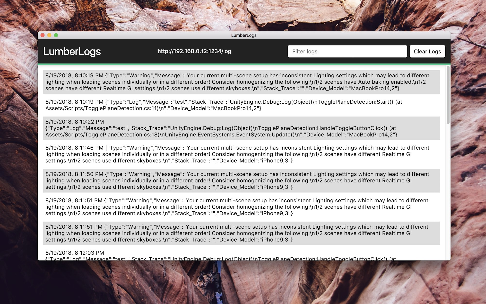

# LumberLogs

> A self-hosted log aggregation tool.

[](https://trello.com/b/BIqhJuLP/lumberlog)



## Setup

Install required packages via node.

```bash
$ npm install
```

Run the server.

```bash
$ npm start
```

Running the server with a custom port.

```bash
$ PORT=5000 npm start
```

## Usage

### Bash

```bash
$ curl -H "content-type:text/plain" -d 'Hello, world.' http://localhost:8000/log
```

```bash
$ curl -H "content-type:application/json" -d '{"message":"Hello, world."}' http://localhost:8000/log
```

### JavaScript

```javascript
fetch('http://localhost:8000/log', {
    method: 'POST',
    body: 'Hello, world.'
});
```

```javascript
fetch('http://localhost:8000/log', {
    method: 'POST',
    body: JSON.stringify({'message': 'Hello, world.'}),
    headers: {
        'Content-Type': 'application/json'
    },
});
```

### Unity

```csharp
using System.Collections;
using UnityEngine;

#if UNITY_EDITOR || DEVELOPMENT_BUILD

public class Logger : MonoBehaviour
{

    [SerializeField]
    private string url;

    private int failedConnections;

    private readonly int maxFailedConnections = 10;

    private void OnEnable()
    {

        Application.logMessageReceived += HandleLog;

    }

    private void OnDisable()
    {

        Application.logMessageReceived -= HandleLog;

    }

    private void HandleLog(string logString, string stackTrace, LogType type)
    {

        if (url != null && failedConnections < maxFailedConnections)
        {

            var loggingForm = new WWWForm();

            loggingForm.AddField("Type", type.ToString());
            loggingForm.AddField("Message", logString);
            loggingForm.AddField("Stack_Trace", stackTrace);
            loggingForm.AddField("Device_Model", SystemInfo.deviceModel);

            StartCoroutine(SendDataToLumberLog(loggingForm));

        }

    }

    private IEnumerator SendDataToLumberLog(WWWForm form)
    {
        using (WWW www = new WWW(url, form))
        {

            yield return www;

            if (!string.IsNullOrEmpty(www.error))
            {

                Debug.LogError(www.error);

                failedConnections += 1;

            }

        }

    }

}

#endif
```
