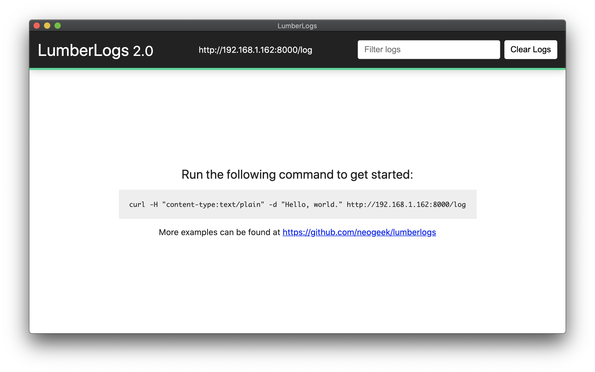

# LumberLog

> A self-hosted log aggregation tool.

[](https://trello.com/b/BIqhJuLP/lumberlog)



## Setup

Install required packages via node.

```bash
$ npm install
```

Run the server.

```bash
$ npm start
```

Running the server with a custom port.

```bash
$ PORT=5000 npm start
```

## Usage

### Bash

```bash
$ curl -H "content-type:text/plain" -d 'HelloWorld' http://localhost:8000/log
```

### Unity

```csharp
using UnityEngine;

public class Logger : MonoBehaviour
{

    private void Awake()
    {

        Application.logMessageReceived += HandleLog;

    }

    private void HandleLog(string logString, string stackTrace, LogType type)
    {

        var loggingForm = new WWWForm();

        loggingForm.AddField("Type", type.ToString());
        loggingForm.AddField("Message", logString);
        loggingForm.AddField("Stack_Trace", stackTrace);
        loggingForm.AddField("Device_Model", SystemInfo.deviceModel);

        var sendLog = new WWW("http://localhost:8000/log", loggingForm);

    }

}
```
